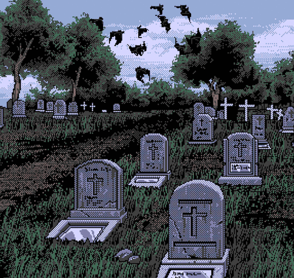

<h1 align="center">Engineer Mimi 🐾</h1>

  
  &nbsp;
  

 

  <b>Software Engineer</b> with a strong interest in <b>system-level development</b> 
  I don’t just write code, I engineer systems that are meant to last.

  <code>C</code>
  <code>C++</code>
  <code>Python</code>
  <code>Java</code>
  <code>JavaScript</code>
  <code>TypeScript</code>
  <code>Go</code>
  <code>Rust</code>
  <code>Bash</code>
  <code>SQL</code>

